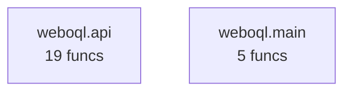
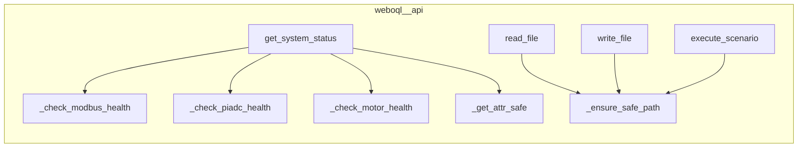
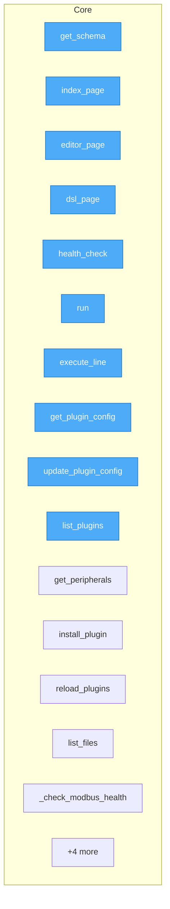

# WebOQL — Web-based OQL Scenario Editor

WebOQL — Web-based OQL scenario editor and executor

## Metadata

- **name**: `weboql`
- **version**: `0.1.2`
- **python_requires**: `>=3.10`
- **license**: Apache-2.0
- **ai_model**: `openrouter/qwen/qwen3-coder-next`
- **ecosystem**: SUMD + DOQL + testql + taskfile
- **openapi_title**: weboql API v1.0.0
- **generated_from**: pyproject.toml, Taskfile.yml, Makefile, testql(2), openapi(17 ep), app.doql.less, app.doql.css, pyqual.yaml, goal.yaml, .env.example, src(1 mod), project/(10 analysis files)

## Intent

WebOQL — Web-based OQL scenario editor and executor

## Architecture

```
SUMD (description) → DOQL/source (code) → taskfile (automation) → testql (verification)
```

### DOQL Application Declaration (`app.doql.less`, `app.doql.css`)

```less
// LESS format — define @variables here as needed

app {
  name: weboql;
  version: 0.1.2;
}

interface[type="api"] {
  type: rest;
  framework: fastapi;
}

integration[name="modbus"] {
  type: hardware;
  type: hardware;
}

workflow[name="install"] {
  trigger: manual;
  step-1: run cmd=pip install -e .;
}

workflow[name="dev"] {
  trigger: manual;
  step-1: run cmd=pip install -e ".[dev]";
}

workflow[name="build"] {
  trigger: manual;
  step-1: run cmd=python -m build;
}

workflow[name="run"] {
  trigger: manual;
  step-1: run cmd=HARDWARE_MODE=mock weboql-server;
}

workflow[name="run-prod"] {
  trigger: manual;
  step-1: run cmd=weboql-server;
}

workflow[name="test"] {
  trigger: manual;
  step-1: run cmd=pytest;
}

workflow[name="test-e2e"] {
  trigger: manual;
  step-1: run cmd=./tests/e2e.sh;
}

workflow[name="test-hardware-cli"] {
  trigger: manual;
  step-1: run cmd=./tests/test-hardware-cli.sh;
}

workflow[name="clean"] {
  trigger: manual;
  step-1: run cmd=rm -rf dist/ build/ *.egg-info;
  step-2: run cmd=find . -type d -name __pycache__ -exec rm -rf {} +;
  step-3: run cmd=find . -type f -name "*.pyc" -delete;
}

workflow[name="publish"] {
  trigger: manual;
  step-1: run cmd=twine upload dist/*;
}

workflow[name="publish-test"] {
  trigger: manual;
  step-1: run cmd=twine upload --repository testpypi dist/;
}

workflow[name="quality"] {
  trigger: manual;
  step-1: run cmd=pyqual run;
}

workflow[name="quality:fix"] {
  trigger: manual;
  step-1: run cmd=pyqual run --fix;
}

workflow[name="quality:report"] {
  trigger: manual;
  step-1: run cmd=pyqual report;
}

workflow[name="lint"] {
  trigger: manual;
  step-1: run cmd=ruff check .;
}

workflow[name="fmt"] {
  trigger: manual;
  step-1: run cmd=ruff format .;
}

workflow[name="run:prod"] {
  trigger: manual;
  step-1: run cmd=weboql-server;
}

workflow[name="test:e2e"] {
  trigger: manual;
  step-1: run cmd=testql suite --pattern "testql-scenarios/*api*.testql.toon.yaml";
}

workflow[name="test:hardware"] {
  trigger: manual;
  step-1: run cmd=testql suite --pattern "testql-scenarios/*hardware*.testql.toon.yaml" || echo "No hardware tests found";
}

workflow[name="test:all"] {
  trigger: manual;
  step-1: run cmd=testql suite --path testql-scenarios/;
}

workflow[name="test:list"] {
  trigger: manual;
  step-1: run cmd=testql list --path testql-scenarios/;
}

workflow[name="publish:test"] {
  trigger: manual;
  step-1: run cmd=twine upload --repository testpypi dist/;
}

workflow[name="doql:adopt"] {
  trigger: manual;
  step-1: run cmd=if ! command -v {{.DOQL_CMD}} >/dev/null 2>&1; then
echo "⚠️  doql not installed. Install: pip install doql"
exit 1
fi;
  step-2: run cmd={{.DOQL_CMD}} adopt {{.PWD}} --output app.doql.css --force;
  step-3: run cmd={{.DOQL_CMD}} export --format less -o {{.DOQL_OUTPUT}};
  step-4: run cmd=echo "✅ Project structure captured in {{.DOQL_OUTPUT}}";
}

workflow[name="doql:validate"] {
  trigger: manual;
  step-1: run cmd=if [ ! -f "{{.DOQL_OUTPUT}}" ]; then
echo "❌ {{.DOQL_OUTPUT}} not found. Run: task doql:adopt"
exit 1
fi;
  step-2: run cmd={{.DOQL_CMD}} validate;
}

workflow[name="doql:doctor"] {
  trigger: manual;
  step-1: run cmd={{.DOQL_CMD}} doctor;
}

workflow[name="doql:build"] {
  trigger: manual;
  step-1: run cmd=if [ ! -f "{{.DOQL_OUTPUT}}" ]; then
echo "❌ {{.DOQL_OUTPUT}} not found. Run: task doql:adopt"
exit 1
fi;
  step-2: run cmd=# Regenerate LESS from CSS if CSS exists
if [ -f "app.doql.css" ]; then
{{.DOQL_CMD}} export --format less -o {{.DOQL_OUTPUT}}
fi;
  step-3: run cmd={{.DOQL_CMD}} build app.doql.css --out build/;
}

workflow[name="help"] {
  trigger: manual;
  step-1: run cmd=task --list;
}

deploy {
  target: makefile;
}

environment[name="local"] {
  runtime: docker-compose;
  env_file: .env;
}
```

```css
app {
  name: "weboql";
  version: "0.1.2";
}

interface[type="api"] {
  type: rest;
  framework: fastapi;
}

integration[name="modbus"] {
  type: "hardware";
}

workflow[name="install"] {
  trigger: "manual";
  step-1: run cmd=pip install -e .;
}

workflow[name="dev"] {
  trigger: "manual";
  step-1: run cmd=pip install -e ".[dev]";
}

workflow[name="build"] {
  trigger: "manual";
  step-1: run cmd=python -m build;
}

workflow[name="run"] {
  trigger: "manual";
  step-1: run cmd=HARDWARE_MODE=mock weboql-server;
}

workflow[name="run-prod"] {
  trigger: "manual";
  step-1: run cmd=weboql-server;
}

workflow[name="test"] {
  trigger: "manual";
  step-1: run cmd=pytest;
}

workflow[name="test-e2e"] {
  trigger: "manual";
  step-1: run cmd=./tests/e2e.sh;
}

workflow[name="test-hardware-cli"] {
  trigger: "manual";
  step-1: run cmd=./tests/test-hardware-cli.sh;
}

workflow[name="clean"] {
  trigger: "manual";
  step-1: run cmd=rm -rf dist/ build/ *.egg-info;
  step-2: run cmd=find . -type d -name __pycache__ -exec rm -rf {} +;
  step-3: run cmd=find . -type f -name "*.pyc" -delete;
}

workflow[name="publish"] {
  trigger: "manual";
  step-1: run cmd=twine upload dist/*;
}

workflow[name="publish-test"] {
  trigger: "manual";
  step-1: run cmd=twine upload --repository testpypi dist/;
}

workflow[name="quality"] {
  trigger: "manual";
  step-1: run cmd=pyqual run;
}

workflow[name="quality:fix"] {
  trigger: "manual";
  step-1: run cmd=pyqual run --fix;
}

workflow[name="quality:report"] {
  trigger: "manual";
  step-1: run cmd=pyqual report;
}

workflow[name="lint"] {
  trigger: "manual";
  step-1: run cmd=ruff check .;
}

workflow[name="fmt"] {
  trigger: "manual";
  step-1: run cmd=ruff format .;
}

workflow[name="run:prod"] {
  trigger: "manual";
  step-1: run cmd=weboql-server;
}

workflow[name="test:e2e"] {
  trigger: "manual";
  step-1: run cmd=testql suite --pattern "testql-scenarios/*api*.testql.toon.yaml";
}

workflow[name="test:hardware"] {
  trigger: "manual";
  step-1: run cmd=testql suite --pattern "testql-scenarios/*hardware*.testql.toon.yaml" || echo "No hardware tests found";
}

workflow[name="test:all"] {
  trigger: "manual";
  step-1: run cmd=testql suite --path testql-scenarios/;
}

workflow[name="test:list"] {
  trigger: "manual";
  step-1: run cmd=testql list --path testql-scenarios/;
}

workflow[name="publish:test"] {
  trigger: "manual";
  step-1: run cmd=twine upload --repository testpypi dist/;
}

workflow[name="doql:adopt"] {
  trigger: "manual";
  step-1: run cmd=if ! command -v {{.DOQL_CMD}} >/dev/null 2>&1; then
  echo "⚠️  doql not installed. Install: pip install doql"
  exit 1
fi;
  step-2: run cmd={{.DOQL_CMD}} adopt {{.PWD}} --output app.doql.css --force;
  step-3: run cmd={{.DOQL_CMD}} export --format less -o {{.DOQL_OUTPUT}};
  step-4: run cmd=echo "✅ Project structure captured in {{.DOQL_OUTPUT}}";
}

workflow[name="doql:validate"] {
  trigger: "manual";
  step-1: run cmd=if [ ! -f "{{.DOQL_OUTPUT}}" ]; then
  echo "❌ {{.DOQL_OUTPUT}} not found. Run: task doql:adopt"
  exit 1
fi;
  step-2: run cmd={{.DOQL_CMD}} validate;
}

workflow[name="doql:doctor"] {
  trigger: "manual";
  step-1: run cmd={{.DOQL_CMD}} doctor;
}

workflow[name="doql:build"] {
  trigger: "manual";
  step-1: run cmd=if [ ! -f "{{.DOQL_OUTPUT}}" ]; then
  echo "❌ {{.DOQL_OUTPUT}} not found. Run: task doql:adopt"
  exit 1
fi;
  step-2: run cmd=# Regenerate LESS from CSS if CSS exists
if [ -f "app.doql.css" ]; then
  {{.DOQL_CMD}} export --format less -o {{.DOQL_OUTPUT}}
fi;
  step-3: run cmd={{.DOQL_CMD}} build app.doql.css --out build/;
}

workflow[name="help"] {
  trigger: "manual";
  step-1: run cmd=task --list;
}

deploy {
  target: makefile;
}

environment[name="local"] {
  runtime: docker-compose;
  env_file: ".env";
}
```

### Source Modules

- `weboql.main`

## Interfaces

### CLI Entry Points

- `weboql-server`

### REST API (from `openapi.yaml`)

```yaml
components:
  schemas:
    Error:
      properties:
        code:
          type: integer
        error:
          type: string
        message:
          type: string
      type: object
    HealthCheck:
      properties:
        status:
          enum:
          - ok
          - error
          type: string
        timestamp:
          format: date-time
          type: string
        version:
          type: string
      type: object
info:
  description: Auto-generated OpenAPI spec for weboql
  title: weboql API
  version: 1.0.0
openapi: 3.0.3
paths:
  /:
    get:
      operationId: index_page
      responses:
        '200': &id004
          content:
            application/json:
              schema:
                type: object
          description: Success
        '401': &id001
          description: Unauthorized
        '404': &id002
          description: Not Found
        '500': &id003
          description: Internal Server Error
      summary: Serve the editor UI at root
      tags:
      - fastapi
  /api/v1/editor/execute:
    post:
      operationId: execute_scenario
      requestBody:
        content:
          application/json:
            schema:
              type: object
        required: true
      responses:
        '201': &id005
          content:
            application/json:
              schema:
                type: object
          description: Created
        '400': &id006
          content:
            application/json:
              schema:
                properties:
                  detail:
                    type: string
                  error:
                    type: string
                type: object
          description: Bad Request
        '401': *id001
        '404': *id002
        '500': *id003
      summary: Execute a scenario file using oqlos runtime
      tags:
      - v1
      - fastapi
  /api/v1/editor/file/{file_path:path}:
    get:
      operationId: read_file
      parameters:
      - in: path
        name: file_path:path
        required: true
        schema:
          type: string
      - in: query
        name: file_path
        required: false
        schema:
          type: str
      responses:
        '200': *id004
        '401': *id001
        '404': *id002
        '500': *id003
      summary: Read a file's content
      tags:
      - v1
      - fastapi
    post:
      operationId: write_file
      parameters:
      - in: path
        name: file_path:path
        required: true
        schema:
          type: string
      - in: query
        name: file_path
        required: false
        schema:
          type: str
      requestBody:
        content:
          application/json:
            schema:
              type: object
        required: true
      responses:
        '201': *id005
        '400': *id006
        '401': *id001
        '404': *id002
        '500': *id003
      summary: Write content to a file
      tags:
      - v1
      - fastapi
  /api/v1/editor/files:
    get:
      operationId: list_files
      responses:
        '200': *id004
        '401': *id001
        '404': *id002
        '500': *id003
      summary: List all files in the scenarios directory
      tags:
      - v1
      - fastapi
  /api/v1/editor/status:
    get:
      operationId: get_system_status
      responses:
        '200': *id004
        '401': *id001
        '404': *id002
        '500': *id003
      summary: Get system status and configuration.
      tags:
      - v1
      - fastapi
  /api/v1/plugins/config:
    get:
      operationId: get_plugin_config
      responses:
        '200': *id004
        '401': *id001
        '404': *id002
        '500': *id003
      summary: Return the unified plugin YAML config as structured data + raw text.
      tags:
      - v1
      - fastapi
    put:
      operationId: update_plugin_config
      requestBody:
        content:
          application/json:
            schema:
              properties:
                data:
                  type: object
                id:
                  type: string
                name:
                  type: string
              type: object
        required: true
      responses:
        '200': *id004
        '401': *id001
        '404': *id002
        '500': *id003
      summary: Overwrite the unified plugin YAML config with new content.
      tags:
      - v1
      - fastapi
  /api/v1/plugins/execute-line:
    post:
      operationId: execute_line
      requestBody:
        content:
          application/json:
            schema:
              type: object
        required: true
      responses:
        '201': *id005
        '400': *id006
        '401': *id001
        '404': *id002
        '500': *id003
      summary: Execute a single OQL/CQL line or snippet and return the result.
      tags:
      - v1
      - fastapi
  /api/v1/plugins/install:
    post:
      operationId: install_plugin
      requestBody:
        content:
          application/json:
            schema:
              type: object
        required: true
      responses:
        '201': *id005
        '400': *id006
        '401': *id001
        '404': *id002
        '500': *id003
      summary: pip-install a plugin package into the current venv.
      tags:
      - v1
      - fastapi
  /api/v1/plugins/list:
    get:
      operationId: list_plugins
      responses:
        '200': *id004
        '401': *id001
        '404': *id002
        '500': *id003
      summary: List registered plugins (from oqlos.hardware.plugins.PluginRegistry).
      tags:
      - v1
      - fastapi
  /api/v1/plugins/peripherals/{plugin_id}:
    get:
      operationId: get_peripherals
      parameters:
      - in: path
        name: plugin_id
        required: true
        schema:
          type: string
      - in: query
        name: plugin_id
        required: false
        schema:
          type: str
      responses:
        '200': *id004
        '401': *id001
        '404': *id002
        '500': *id003
      summary: Return peripheral definitions for a plugin from the YAML config.
      tags:
      - v1
      - fastapi
  /api/v1/plugins/reload:
    post:
      operationId: reload_plugins
      requestBody:
        content:
          application/json:
            schema:
              type: object
        required: true
      responses:
        '201': *id005
        '400': *id006
        '401': *id001
        '404': *id002
        '500': *id003
      summary: Reload plugin configs from YAML and re-discover entry points.
      tags:
      - v1
      - fastapi
  /api/v1/schema:
    get:
      operationId: get_api_v1_schema
      responses:
        '200': *id004
        '401': *id001
        '404': *id002
        '500': *id003
      summary: GET /api/v1/schema
      tags:
      - inferred-from-tests
      - v1
  /dsl:
    get:
      operationId: dsl_page
      responses:
        '200': *id004
        '401': *id001
        '404': *id002
        '500': *id003
      summary: Serve the shared DSL schema client.
      tags:
      - fastapi
  /editor:
    get:
      operationId: editor_page
      responses:
        '200': *id004
        '401': *id001
        '404': *id002
        '500': *id003
      summary: Serve the editor UI
      tags:
      - fastapi
  /health:
    get:
      operationId: health_check
      responses:
        '200': *id004
        '401': *id001
        '404': *id002
        '500': *id003
      summary: Health check endpoint
      tags:
      - fastapi
  /http://localhost:8101/:
    get:
      operationId: index_page
      responses:
        '200': *id004
        '401': *id001
        '404': *id002
        '500': *id003
      summary: Serve the editor UI at root
      tags:
      - openapi
      - 'http:'
  /http://localhost:8101/api/v1/editor/execute:
    post:
      operationId: execute_scenario
      requestBody:
        content:
          application/json:
            schema:
              type: object
        required: true
      responses:
        '201': *id005
        '400': *id006
        '401': *id001
        '404': *id002
        '500': *id003
      summary: Execute a scenario file using oqlos runtime
      tags:
      - openapi
      - 'http:'
  /http://localhost:8101/api/v1/editor/file/{file_path:path}:
    get:
      operationId: read_file
      parameters:
      - in: path
        name: file_path:path
        required: true
        schema:
          type: string
      - in: query
        name: file_path
        required: false
        schema:
          type: string
      responses:
        '200': *id004
        '401': *id001
        '404': *id002
        '500': *id003
      summary: Read a file's content
      tags:
      - openapi
      - 'http:'
    post:
      operationId: write_file
      parameters:
      - in: path
        name: file_path:path
        required: true
        schema:
          type: string
      - in: query
        name: file_path
        required: false
        schema:
          type: string
      requestBody:
        content:
          application/json:
            schema:
              type: object
        required: true
      responses:
        '201': *id005
        '400': *id006
        '401': *id001
        '404': *id002
        '500': *id003
      summary: Write content to a file
      tags:
      - openapi
      - 'http:'
  /http://localhost:8101/api/v1/editor/files:
    get:
      operationId: list_files
      responses:
        '200': *id004
        '401': *id001
        '404': *id002
        '500': *id003
      summary: List all files in the scenarios directory
      tags:
      - openapi
      - 'http:'
  /http://localhost:8101/api/v1/editor/status:
    get:
      operationId: get_system_status
      responses:
        '200': *id004
        '401': *id001
        '404': *id002
        '500': *id003
      summary: Get system status and configuration.
      tags:
      - openapi
      - 'http:'
  /http://localhost:8101/api/v1/plugins/config:
    get:
      operationId: get_plugin_config
      responses:
        '200': *id004
        '401': *id001
        '404': *id002
        '500': *id003
      summary: Return the unified plugin YAML config as structured data + raw text.
      tags:
      - openapi
      - 'http:'
    put:
      operationId: update_plugin_config
      requestBody:
        content:
          application/json:
            schema:
              properties:
                data:
                  type: object
                id:
                  type: string
                name:
                  type: string
              type: object
        required: true
      responses:
        '200': *id004
        '401': *id001
        '404': *id002
        '500': *id003
      summary: Overwrite the unified plugin YAML config with new content.
      tags:
      - openapi
      - 'http:'
  /http://localhost:8101/api/v1/plugins/execute-line:
    post:
      operationId: execute_line
      requestBody:
        content:
          application/json:
            schema:
              type: object
        required: true
      responses:
        '201': *id005
        '400': *id006
        '401': *id001
        '404': *id002
        '500': *id003
      summary: Execute a single OQL/CQL line or snippet and return the result.
      tags:
      - openapi
      - 'http:'
  /http://localhost:8101/api/v1/plugins/install:
    post:
      operationId: install_plugin
      requestBody:
        content:
          application/json:
            schema:
              type: object
        required: true
      responses:
        '201': *id005
        '400': *id006
        '401': *id001
        '404': *id002
        '500': *id003
      summary: pip-install a plugin package into the current venv.
      tags:
      - openapi
      - 'http:'
  /http://localhost:8101/api/v1/plugins/list:
    get:
      operationId: list_plugins
      responses:
        '200': *id004
        '401': *id001
        '404': *id002
        '500': *id003
      summary: List registered plugins (from oqlos.hardware.plugins.PluginRegistry).
      tags:
      - openapi
      - 'http:'
  /http://localhost:8101/api/v1/plugins/peripherals/{plugin_id}:
    get:
      operationId: get_peripherals
      parameters:
      - in: path
        name: plugin_id
        required: true
        schema:
          type: string
      - in: query
        name: plugin_id
        required: false
        schema:
          type: string
      responses:
        '200': *id004
        '401': *id001
        '404': *id002
        '500': *id003
      summary: Return peripheral definitions for a plugin from the YAML config.
      tags:
      - openapi
      - 'http:'
  /http://localhost:8101/api/v1/plugins/reload:
    post:
      operationId: reload_plugins
      requestBody:
        content:
          application/json:
            schema:
              type: object
        required: true
      responses:
        '201': *id005
        '400': *id006
        '401': *id001
        '404': *id002
        '500': *id003
      summary: Reload plugin configs from YAML and re-discover entry points.
      tags:
      - openapi
      - 'http:'
  /http://localhost:8101/api/v1/schema:
    get:
      operationId: get_api_v1_schema
      responses:
        '200': *id004
        '401': *id001
        '404': *id002
        '500': *id003
      summary: GET /api/v1/schema
      tags:
      - openapi
      - 'http:'
  /http://localhost:8101/dsl:
    get:
      operationId: dsl_page
      responses:
        '200': *id004
        '401': *id001
        '404': *id002
        '500': *id003
      summary: Serve the shared DSL schema client.
      tags:
      - openapi
      - 'http:'
  /http://localhost:8101/editor:
    get:
      operationId: editor_page
      responses:
        '200': *id004
        '401': *id001
        '404': *id002
        '500': *id003
      summary: Serve the editor UI
      tags:
      - openapi
      - 'http:'
  /http://localhost:8101/health:
    get:
      operationId: health_check
      responses:
        '200': *id004
        '401': *id001
        '404': *id002
        '500': *id003
      summary: Health check endpoint
      tags:
      - openapi
      - 'http:'
servers:
- description: Local development
  url: http://localhost:8101
- description: Relative
  url: /
```

### testql Scenarios

#### `testql-scenarios/generated-api-integration.testql.toon.yaml`

```toon
# SCENARIO: API Integration Tests
# TYPE: api
# GENERATED: true

CONFIG[3]{key, value}:
  base_url, http://localhost:8101
  timeout_ms, 30000
  retry_count, 3

API[4]{method, endpoint, expected_status}:
  GET, /health, 200
  GET, /api/v1/status, 200
  POST, /api/v1/test, 201
  GET, /api/v1/docs, 200

ASSERT[2]{field, operator, expected}:
  status, ==, ok
  response_time, <, 1000
```

#### `testql-scenarios/generated-api-smoke.testql.toon.yaml`

```toon
# SCENARIO: Auto-generated API Smoke Tests
# TYPE: api
# GENERATED: true
# DETECTORS: FastAPIDetector, TestEndpointDetector

CONFIG[4]{key, value}:
  base_url, http://localhost:8101
  timeout_ms, 10000
  retry_count, 3
  detected_frameworks, FastAPIDetector, TestEndpointDetector

# REST API Endpoints (14 unique)
API[14]{method, endpoint, expected_status}:
  GET, /, 200  # index_page - Serve the editor UI at root
  GET, /editor, 200  # editor_page - Serve the editor UI
  GET, /dsl, 200  # dsl_page - Serve the shared DSL schema client.
  GET, /health, 200  # health_check - Health check endpoint
  GET, /api/v1/editor/files, 200  # list_files - List all files in the scenarios directory
  GET, /api/v1/editor/status, 200  # get_system_status - Get system status and configuration.
  POST, /api/v1/editor/execute, 201  # execute_scenario - Execute a scenario file using oqlos runtime
  POST, /api/v1/plugins/execute-line, 201  # execute_line - Execute a single OQL/CQL line or snippet and retur
  GET, /api/v1/plugins/config, 200  # get_plugin_config - Return the unified plugin YAML config as structure
  PUT, /api/v1/plugins/config, 201  # update_plugin_config - Overwrite the unified plugin YAML config with new 
  GET, /api/v1/plugins/list, 200  # list_plugins - List registered plugins (from oqlos.hardware.plugi
  POST, /api/v1/plugins/install, 201  # install_plugin - pip-install a plugin package into the current venv
  POST, /api/v1/plugins/reload, 201  # reload_plugins - Reload plugin configs from YAML and re-discover en
  GET, /api/v1/schema, 200

ASSERT[2]{field, operator, expected}:
  status, <, 500
  response_time, <, 2000

# Summary by Framework:
#   fastapi: 16 endpoints
#   inferred-from-tests: 1 endpoints
```

## Workflows

### Taskfile Tasks (`Taskfile.yml`)

```yaml
tasks:
  install:
    desc: "Install Python dependencies (editable)"
    cmds:
      - pip install -e .[dev]
  dev:
    desc: "Install in dev mode"
    cmds:
      - pip install -e ".[dev]"
  quality:
    desc: "Run pyqual quality pipeline (test + lint + format check)"
    cmds:
      - pyqual run
  quality:fix:
    desc: "Run pyqual with auto-fix (format + lint fix)"
    cmds:
      - pyqual run --fix
  quality:report:
    desc: "Generate pyqual quality report"
    cmds:
      - pyqual report
  test:
    desc: "Run pytest suite"
    cmds:
      - pytest -q
  lint:
    desc: "Run ruff lint check"
    cmds:
      - ruff check .
  fmt:
    desc: "Auto-format with ruff"
    cmds:
      - ruff format .
  build:
    desc: "Build wheel + sdist"
    cmds:
      - python -m build
  clean:
    desc: "Remove build artefacts"
    cmds:
      - rm -rf build/ dist/ *.egg-info
  all:
    desc: "Run install, quality check, test"
  run:
    desc: "Run weboql server (mock mode)"
    cmds:
      - HARDWARE_MODE=mock weboql-server
  run:prod:
    desc: "Run weboql server (production)"
    cmds:
      - weboql-server
  test:e2e:
    desc: "Run E2E tests via testql"
    cmds:
      - testql suite --pattern "testql-scenarios/*api*.testql.toon.yaml"
  test:hardware:
    desc: "Run hardware CLI tests via testql"
    cmds:
      - testql suite --pattern "testql-scenarios/*hardware*.testql.toon.yaml" || echo "No hardware tests found"
  test:all:
    desc: "Run all testql scenarios"
    cmds:
      - testql suite --path testql-scenarios/
  test:list:
    desc: "List available testql tests"
    cmds:
      - testql list --path testql-scenarios/
  publish:
    desc: "Publish to PyPI"
    cmds:
      - twine upload dist/*
  publish:test:
    desc: "Publish to TestPyPI"
    cmds:
      - twine upload --repository testpypi dist/
  doql:adopt:
    desc: "Reverse-engineer weboql project structure"
    cmds:
      - if ! command -v {{.DOQL_CMD}} >/dev/null 2>&1; then
  echo "⚠️  doql not installed. Install: pip install doql"
  exit 1
fi
  doql:validate:
    desc: "Validate app.doql.less syntax"
    cmds:
      - if [ ! -f "{{.DOQL_OUTPUT}}" ]; then
  echo "❌ {{.DOQL_OUTPUT}} not found. Run: task doql:adopt"
  exit 1
fi
  doql:doctor:
    desc: "Run doql health checks"
    cmds:
      - {{.DOQL_CMD}} doctor
  doql:build:
    desc: "Generate code from app.doql.less"
    cmds:
      - if [ ! -f "{{.DOQL_OUTPUT}}" ]; then
  echo "❌ {{.DOQL_OUTPUT}} not found. Run: task doql:adopt"
  exit 1
fi
  analyze:
    desc: "Full doql analysis (adopt + validate + doctor)"
  help:
    desc: "Show available tasks"
    cmds:
      - task --list
```

## Quality Pipeline (`pyqual.yaml`)

```yaml
pipeline:
  name: quality-loop

  # Quickstart: replace all of this with a single profile line:
  #   profile: python-minimal   # analyze → validate → lint → fix → test
  #   profile: python-publish   # + git-push and make-publish
  #   profile: python-secure    # + pip-audit, bandit, detect-secrets
  #   profile: python           # standard (needs manual stage config)
  #   profile: ci               # CI-only, no fix
  # See: pyqual profiles

  # Quality gates — pipeline iterates until ALL pass
  metrics:
    cc_max: 15           # cyclomatic complexity per function
    vallm_pass_min: 45   # actual: 47.6%
    # coverage_min: 80  # disabled - pytest_cov reports null

  # Pipeline stages — use 'tool:' for built-in presets or 'run:' for custom commands
  # See all presets: pyqual tools
  # when: any_stage_fail    — run only when a prior stage in this iteration failed
  # when: metrics_fail      — run only when quality gates are not yet passing
  # when: first_iteration   — run only on iteration 1 (skip re-runs after fix)
  # when: after_fix         — run only after the fix stage ran in this iteration
  stages:
    - name: analyze
      tool: code2llm-filtered   # uses sensible exclude defaults

    - name: validate
      tool: vallm-filtered      # uses sensible exclude defaults

    - name: prefact
      tool: prefact
      optional: true
      when: any_stage_fail
      timeout: 900

    - name: fix
      tool: llx-fix
      optional: true
      when: any_stage_fail
      timeout: 1800

    - name: security
      tool: bandit
      optional: true
      timeout: 120

    - name: test
      tool: pytest

    - name: push
      tool: git-push            # built-in: git add + commit + push
      optional: true
      timeout: 120

  # Loop behavior
  loop:
    max_iterations: 3
    on_fail: report      # report | create_ticket | block
    ticket_backends:     # backends to sync when on_fail = create_ticket
      - markdown        # TODO.md (default)
      # - github        # GitHub Issues (requires GITHUB_TOKEN)

  # Environment (optional)
  env:
    LLM_MODEL: openrouter/qwen/qwen3-coder-next
```

## Configuration

```yaml
project:
  name: weboql
  version: 0.1.2
  env: local
```

## Dependencies

### Runtime

- `fastapi>=0.110`
- `uvicorn>=0.28`
- `pydantic>=2.0`
- `oqlos>=0.1.0`
- `goal>=2.1.0`
- `costs>=0.1.20`
- `pfix>=0.1.60`
- `testql>=0.2.0`

### Development

- `pytest`
- `pytest-asyncio`
- `httpx`
- `goal>=2.1.0`
- `costs>=0.1.20`
- `pfix>=0.1.60`

## Deployment

```bash
pip install weboql

# development install
pip install -e .[dev]
```

## Environment Variables (`.env.example`)

| Variable | Default | Description |
|----------|---------|-------------|
| `WEB_PORT` | `8203` | Server Configuration |
| `WEB_HOST` | `0.0.0.0` |  |
| `SCENARIOS_DIR` | `/home/tom/github/oqlos/oqlos/oqlos/scenarios` | Scenarios Directory |
| `PIADC_URL` | `http://localhost:8080` | Hardware Service URLs |
| `MOTOR_URL` | `http://localhost:49055` |  |
| `HARDWARE_MODE` | `mock` | Hardware Mode (mock \| real) |
| `LOG_LEVEL` | `INFO` | Logging (DEBUG \| INFO \| WARNING \| ERROR) |
| `CORS_ORIGINS` | `*` | CORS Settings (comma-separated origins or * for all) |
| `SERVICE_NAME` | `weboql` | Service Metadata |
| `SERVICE_VERSION` | `0.1.0` |  |

## Release Management (`goal.yaml`)

- **versioning**: `semver`
- **commits**: `conventional` scope=`weboql`
- **changelog**: `keep-a-changelog`
- **build strategies**: `python`, `nodejs`, `rust`
- **version files**: `VERSION`, `pyproject.toml:version`, `.venv/lib/python3.13/site-packages/httpcore/__init__.py:__version__`

## Makefile Targets

- `help`
- `install`
- `dev`
- `build`
- `run`
- `run-prod`
- `test`
- `test-e2e`
- `test-hardware-cli`
- `clean`
- `publish`
- `publish-test`

## Code Analysis

### `project/analysis.toon.yaml`

```toon
# code2llm | 8f 655L | python:6,shell:2 | 2026-04-18
# CC̄=3.0 | critical:0/24 | dups:0 | cycles:0

HEALTH[0]: ok

REFACTOR[0]: none needed

PIPELINES[18]:
  [1] Src [get_schema]: get_schema
      PURITY: 100% pure
  [2] Src [index_page]: index_page
      PURITY: 100% pure
  [3] Src [editor_page]: editor_page
      PURITY: 100% pure
  [4] Src [dsl_page]: dsl_page
      PURITY: 100% pure
  [5] Src [health_check]: health_check
      PURITY: 100% pure

LAYERS:
  weboql/                         CC̄=3.0    ←in:0  →out:0
  │ editor                     251L  4C   11m  CC=6      ←0
  │ plugins_api                215L  3C    7m  CC=8      ←0
  │ main                       136L  1C    5m  CC=1      ←0
  │ schema                      15L  0C    1m  CC=1      ←0
  │ __init__                     1L  0C    0m  CC=0.0    ←0
  │ __init__                     1L  0C    0m  CC=0.0    ←0
  │
  ./                              CC̄=0.0    ←in:0  →out:0
  │ project.sh                  35L  0C    0m  CC=0.0    ←0
  │ tree.sh                      1L  0C    0m  CC=0.0    ←0
  │

COUPLING: no cross-package imports detected

EXTERNAL:
  validation: run `vallm batch .` → validation.toon
  duplication: run `redup scan .` → duplication.toon
```

### `project/project.toon.yaml`

```toon
# weboql | 24 func | 4f | 1552L | python | 2026-04-18

HEALTH:
  CC̄=3.0  critical=0 (limit:10)  dup=0  cycles=0

ALERTS[5]:
  !   high_fan_out     execute_line = 12 (limit:10)
  !   high_fan_out     list_files = 12 (limit:10)
  !   high_fan_out     execute_scenario = 12 (limit:10)
  !   high_fan_out     get_system_status = 11 (limit:10)
  !   high_fan_out     install_plugin = 10 (limit:10)

MODULES[8] (top by size):
  M[weboql/api/editor.py] 251L C:4 F:11 CC↑6 D:0 (python)
  M[weboql/api/plugins_api.py] 215L C:3 F:7 CC↑8 D:0 (python)
  M[weboql/main.py] 136L C:1 F:5 CC↑1 D:0 (python)
  M[project.sh] 35L C:0 F:0 CC↑0 D:0 (shell)
  M[weboql/api/schema.py] 15L C:0 F:1 CC↑1 D:0 (python)
  M[tree.sh] 1L C:0 F:0 CC↑0 D:0 (shell)
  M[weboql/__init__.py] 1L C:0 F:0 CC↑0 D:0 (python)
  M[weboql/api/__init__.py] 1L C:0 F:0 CC↑0 D:0 (python)
  LANGS: python:6/shell:2

HOTSPOTS[5]:
  ★ execute_line fan=12  // Execute a single OQL/CQL line or snippet and return the result.
  ★ list_files fan=12  // List all files in the scenarios directory
  ★ execute_scenario fan=12  // Execute a scenario file using oqlos runtime
  ★ get_system_status fan=11  // Get system status and configuration.

Refactored from CC=18 to CC<10 using helpe
  ★ install_plugin fan=10  // pip-install a plugin package into the current venv.

Example request body::

   

EVOLUTION:
  2026-04-18 CC̄=3.0 crit=0 1552L // Automated analysis
```

### `project/evolution.toon.yaml`

```toon
# code2llm/evolution | 24 func | 4f | 2026-04-18

NEXT[0]: no refactoring needed

RISKS[0]: none

METRICS-TARGET:
  CC̄:          3.0 → ≤2.1
  max-CC:      8 → ≤4
  god-modules: 0 → 0
  high-CC(≥15): 0 → ≤0
  hub-types:   0 → ≤0

PATTERNS (language parser shared logic):
  _extract_declarations() in base.py — unified extraction for:
    - TypeScript: interfaces, types, classes, functions, arrow funcs
    - PHP: namespaces, traits, classes, functions, includes
    - Ruby: modules, classes, methods, requires
    - C++: classes, structs, functions, #includes
    - C#: classes, interfaces, methods, usings
    - Java: classes, interfaces, methods, imports
    - Go: packages, functions, structs
    - Rust: modules, functions, traits, use statements

  Shared regex patterns per language:
    - import: language-specific import/require/using patterns
    - class: class/struct/trait declarations with inheritance
    - function: function/method signatures with visibility
    - brace_tracking: for C-family languages ({ })
    - end_keyword_tracking: for Ruby (module/class/def...end)

  Benefits:
    - Consistent extraction logic across all languages
    - Reduced code duplication (~70% reduction in parser LOC)
    - Easier maintenance: fix once, apply everywhere
    - Standardized FunctionInfo/ClassInfo models

HISTORY:
  prev CC̄=3.0 → now CC̄=3.0
```

### `project/map.toon.yaml`

```toon
# weboql | 8f 655L | shell:2,python:6 | 2026-04-18
# stats: 24 func | 0 cls | 8 mod | CC̄=3.0 | critical:0 | cycles:0
# alerts[5]: fan-out execute_line=12; fan-out execute_scenario=12; fan-out list_files=12; fan-out get_system_status=11; fan-out install_plugin=10
# hotspots[5]: execute_line fan=12; list_files fan=12; execute_scenario fan=12; get_system_status fan=11; install_plugin fan=10
# evolution: CC̄ 3.0→3.0 (flat 0.0)
# Keys: M=modules, D=details, i=imports, e=exports, c=classes, f=functions, m=methods
M[8]:
  project.sh,35
  tree.sh,1
  weboql/__init__.py,1
  weboql/api/__init__.py,1
  weboql/api/editor.py,251
  weboql/api/plugins_api.py,215
  weboql/api/schema.py,15
  weboql/main.py,136
D:
  weboql/api/plugins_api.py:
    e: LineExecutionRequest,PluginInstallRequest,PluginConfigUpdate,execute_line,get_plugin_config,update_plugin_config,list_plugins,get_peripherals,install_plugin,reload_plugins
    LineExecutionRequest(BaseModel):
    PluginInstallRequest(BaseModel):  # Install a plugin package from PyPI or a local path...
    PluginConfigUpdate(BaseModel):  # Full or partial YAML content to write back...
    execute_line(request)
    get_plugin_config()
    update_plugin_config(body)
    list_plugins()
    get_peripherals(plugin_id)
    install_plugin(request)
    reload_plugins()
  weboql/api/editor.py:
    e: SystemStatus,FileInfo,FileContent,ExecutionRequest,_ensure_safe_path,list_files,_check_piadc_health,_check_motor_health,_check_modbus_health,_count_scenario_files,_get_attr_safe,get_system_status,read_file,write_file,execute_scenario
    SystemStatus(BaseModel):  # System status information...
    FileInfo(BaseModel):
    FileContent(BaseModel):
    ExecutionRequest(BaseModel):
    _ensure_safe_path(file_path)
    list_files()
    _check_piadc_health(piadc_url)
    _check_motor_health(motor_url)
    _check_modbus_health(modbus_serial_port)
    _count_scenario_files()
    _get_attr_safe(obj;attr;default)
    get_system_status()
    read_file(file_path)
    write_file(file_path;file_content)
    execute_scenario(request)
  weboql/api/schema.py:
    e: get_schema
    get_schema()
  weboql/main.py:
    e: Settings,index_page,editor_page,dsl_page,health_check,run
    Settings(BaseSettings):  # Application settings loaded from environment variables and ...
    index_page()
    editor_page()
    dsl_page()
    health_check()
    run()
  project.sh:
  tree.sh:
  weboql/api/__init__.py:
  weboql/__init__.py:
```

### `project/duplication.toon.yaml`

```toon
# redup/duplication | 2 groups | 6f 619L | 2026-04-18

SUMMARY:
  files_scanned: 6
  total_lines:   619
  dup_groups:    2
  dup_fragments: 5
  saved_lines:   25
  scan_ms:       3836

HOTSPOTS[2] (files with most duplication):
  weboql/api/editor.py  dup=22L  groups=1  frags=2  (3.6%)
  weboql/main.py  dup=21L  groups=1  frags=3  (3.4%)

DUPLICATES[2] (ranked by impact):
  [e8a0e90bdc6dded9]   STRU  index_page  L=7 N=3 saved=14 sim=1.00
      weboql/main.py:88-94  (index_page)
      weboql/main.py:98-104  (editor_page)
      weboql/main.py:108-114  (dsl_page)
  [53e1aeacc054dc31]   STRU  _check_piadc_health  L=11 N=2 saved=11 sim=1.00
      weboql/api/editor.py:82-92  (_check_piadc_health)
      weboql/api/editor.py:95-105  (_check_motor_health)

REFACTOR[2] (ranked by priority):
  [1] ○ extract_function   → weboql/utils/index_page.py
      WHY: 3 occurrences of 7-line block across 1 files — saves 14 lines
      FILES: weboql/main.py
  [2] ○ extract_function   → weboql/api/utils/_check_piadc_health.py
      WHY: 2 occurrences of 11-line block across 1 files — saves 11 lines
      FILES: weboql/api/editor.py

QUICK_WINS[2] (low risk, high savings — do first):
  [1] extract_function   saved=14L  → weboql/utils/index_page.py
      FILES: main.py
  [2] extract_function   saved=11L  → weboql/api/utils/_check_piadc_health.py
      FILES: editor.py

EFFORT_ESTIMATE (total ≈ 0.8h):
  easy   index_page                          saved=14L  ~28min
  easy   _check_piadc_health                 saved=11L  ~22min

METRICS-TARGET:
  dup_groups:  2 → 0
  saved_lines: 25 lines recoverable
```

### `project/validation.toon.yaml`

```toon
# vallm batch | 42f | 20✓ 0⚠ 0✗ | 2026-04-18

SUMMARY:
  scanned: 42  passed: 20 (47.6%)  warnings: 0  errors: 0  unsupported: 22

UNSUPPORTED[5]{bucket,count}:
  *.md,7
  *.txt,1
  *.yml,2
  *.example,1
  other,11
```

### `project/compact_flow.mmd`



### `project/calls.mmd`



### `project/flow.mmd`



### `project/context.md`

# System Architecture Analysis

## Overview

- **Project**: /home/tom/github/oqlos/weboql
- **Primary Language**: python
- **Languages**: python: 6, shell: 2
- **Analysis Mode**: static
- **Total Functions**: 24
- **Total Classes**: 8
- **Modules**: 8
- **Entry Points**: 18

## Architecture by Module

### weboql.api.editor
- **Functions**: 11
- **Classes**: 4
- **File**: `editor.py`

### weboql.api.plugins_api
- **Functions**: 7
- **Classes**: 3
- **File**: `plugins_api.py`

### weboql.main
- **Functions**: 5
- **Classes**: 1
- **File**: `main.py`

### weboql.api.schema
- **Functions**: 1
- **File**: `schema.py`

## Key Entry Points

Main execution flows into the system:

### weboql.api.editor.get_system_status
> Get system status and configuration.

Refactored from CC=18 to CC<10 using helper functions.
- **Calls**: router.get, weboql.api.editor._check_modbus_health, SystemStatus, weboql.api.editor._check_piadc_health, weboql.api.editor._check_motor_health, weboql.api.editor._get_attr_safe, logger.error, HTTPException

### weboql.api.editor.execute_scenario
> Execute a scenario file using oqlos runtime
- **Calls**: router.post, logger.info, weboql.api.editor._ensure_safe_path, full_path.read_text, logger.info, CqlInterpreter, interpreter.parse, logger.info

### weboql.api.plugins_api.execute_line
> Execute a single OQL/CQL line or snippet and return the result.
- **Calls**: router.post, request.source.strip, CqlInterpreter, interpreter.parse, interpreter.execute, None.startswith, len, logger.error

### weboql.api.plugins_api.install_plugin
> pip-install a plugin package into the current venv.

Example request body::

    {"package": "oqlos-driver-dri0050>=1.0"}

The package should declare 
- **Calls**: router.post, logger.info, None.join, stdout.decode, asyncio.create_subprocess_exec, asyncio.wait_for, logger.info, logger.error

### weboql.api.editor.list_files
> List all files in the scenarios directory
- **Calls**: router.get, SCENARIOS_DIR.iterdir, item.relative_to, files.append, sorted, logger.error, HTTPException, FileInfo

### weboql.api.editor.read_file
> Read a file's content
- **Calls**: router.get, weboql.api.editor._ensure_safe_path, full_path.is_dir, full_path.read_text, FileContent, full_path.exists, HTTPException, HTTPException

### weboql.api.plugins_api.get_peripherals
> Return peripheral definitions for a plugin from the YAML config.
- **Calls**: router.get, None.get, _DEFAULT_CONFIG.exists, HTTPException, yaml.safe_load, HTTPException, plugin_data.get, _DEFAULT_CONFIG.read_text

### weboql.api.plugins_api.reload_plugins
> Reload plugin configs from YAML and re-discover entry points.
- **Calls**: router.post, PluginRegistry.load_configs_from_yaml, PluginRegistry.discover_entry_point_plugins, len, list, logger.error, HTTPException, configs.keys

### weboql.api.plugins_api.update_plugin_config
> Overwrite the unified plugin YAML config with new content.
- **Calls**: router.put, _DEFAULT_CONFIG.write_text, logger.info, yaml.safe_load, str, ValueError, HTTPException, isinstance

### weboql.api.editor.write_file
> Write content to a file
- **Calls**: router.post, weboql.api.editor._ensure_safe_path, full_path.parent.mkdir, full_path.write_text, logger.error, HTTPException, str

### weboql.api.plugins_api.get_plugin_config
> Return the unified plugin YAML config as structured data + raw text.
- **Calls**: router.get, _DEFAULT_CONFIG.read_text, _DEFAULT_CONFIG.exists, HTTPException, yaml.safe_load, str, data.get

### weboql.api.plugins_api.list_plugins
> List registered plugins (from oqlos.hardware.plugins.PluginRegistry).
- **Calls**: router.get, PluginRegistry.list_plugins, logger.error, HTTPException, str

### weboql.api.schema.get_schema
> Return the canonical CQL/OQL schema for editor clients.
- **Calls**: router.get, get_default_dsl_schema

### weboql.main.index_page
> Serve the editor UI at root
- **Calls**: app.get, serve_html_page

### weboql.main.editor_page
> Serve the editor UI
- **Calls**: app.get, serve_html_page

### weboql.main.dsl_page
> Serve the shared DSL schema client.
- **Calls**: app.get, serve_html_page

### weboql.main.health_check
> Health check endpoint
- **Calls**: app.get, str

### weboql.main.run
> Entry point for weboql-server console script.
- **Calls**: uvicorn.run

## Process Flows

Key execution flows identified:

### Flow 1: get_system_status
```
get_system_status [weboql.api.editor]
  └─> _check_modbus_health
  └─> _check_piadc_health
```

### Flow 2: execute_scenario
```
execute_scenario [weboql.api.editor]
  └─> _ensure_safe_path
```

### Flow 3: execute_line
```
execute_line [weboql.api.plugins_api]
```

### Flow 4: install_plugin
```
install_plugin [weboql.api.plugins_api]
```

### Flow 5: list_files
```
list_files [weboql.api.editor]
```

### Flow 6: read_file
```
read_file [weboql.api.editor]
  └─> _ensure_safe_path
```

### Flow 7: get_peripherals
```
get_peripherals [weboql.api.plugins_api]
```

### Flow 8: reload_plugins
```
reload_plugins [weboql.api.plugins_api]
```

### Flow 9: update_plugin_config
```
update_plugin_config [weboql.api.plugins_api]
```

### Flow 10: write_file
```
write_file [weboql.api.editor]
  └─> _ensure_safe_path
```

## Key Classes

### weboql.main.Settings
> Application settings loaded from environment variables and .env file
- **Methods**: 0
- **Inherits**: BaseSettings

### weboql.api.editor.SystemStatus
> System status information
- **Methods**: 0
- **Inherits**: BaseModel

### weboql.api.editor.FileInfo
- **Methods**: 0
- **Inherits**: BaseModel

### weboql.api.editor.FileContent
- **Methods**: 0
- **Inherits**: BaseModel

### weboql.api.editor.ExecutionRequest
- **Methods**: 0
- **Inherits**: BaseModel

### weboql.api.plugins_api.LineExecutionRequest
- **Methods**: 0
- **Inherits**: BaseModel

### weboql.api.plugins_api.PluginInstallRequest
> Install a plugin package from PyPI or a local path.
- **Methods**: 0
- **Inherits**: BaseModel

### weboql.api.plugins_api.PluginConfigUpdate
> Full or partial YAML content to write back.
- **Methods**: 0
- **Inherits**: BaseModel

## Data Transformation Functions

Key functions that process and transform data:

## Public API Surface

Functions exposed as public API (no underscore prefix):

- `weboql.api.editor.get_system_status` - 20 calls
- `weboql.api.editor.execute_scenario` - 18 calls
- `weboql.api.plugins_api.execute_line` - 14 calls
- `weboql.api.plugins_api.install_plugin` - 14 calls
- `weboql.api.editor.list_files` - 13 calls
- `weboql.api.editor.read_file` - 11 calls
- `weboql.api.plugins_api.get_peripherals` - 9 calls
- `weboql.api.plugins_api.reload_plugins` - 9 calls
- `weboql.api.plugins_api.update_plugin_config` - 8 calls
- `weboql.api.editor.write_file` - 7 calls
- `weboql.api.plugins_api.get_plugin_config` - 7 calls
- `weboql.api.plugins_api.list_plugins` - 5 calls
- `weboql.api.schema.get_schema` - 2 calls
- `weboql.main.index_page` - 2 calls
- `weboql.main.editor_page` - 2 calls
- `weboql.main.dsl_page` - 2 calls
- `weboql.main.health_check` - 2 calls
- `weboql.main.run` - 1 calls

## System Interactions

How components interact:

```mermaid
graph TD
    get_system_status --> get
    get_system_status --> _check_modbus_health
    get_system_status --> SystemStatus
    get_system_status --> _check_piadc_health
    get_system_status --> _check_motor_health
    execute_scenario --> post
    execute_scenario --> info
    execute_scenario --> _ensure_safe_path
    execute_scenario --> read_text
    execute_line --> post
    execute_line --> strip
    execute_line --> CqlInterpreter
    execute_line --> parse
    execute_line --> execute
    install_plugin --> post
    install_plugin --> info
    install_plugin --> join
    install_plugin --> decode
    install_plugin --> create_subprocess_ex
    list_files --> get
    list_files --> iterdir
    list_files --> relative_to
    list_files --> append
    list_files --> sorted
    read_file --> get
    read_file --> _ensure_safe_path
    read_file --> is_dir
    read_file --> read_text
    read_file --> FileContent
    get_peripherals --> get
```



## Reverse Engineering Guidelines

1. **Entry Points**: Start analysis from the entry points listed above
2. **Core Logic**: Focus on classes with many methods
3. **Data Flow**: Follow data transformation functions
4. **Process Flows**: Use the flow diagrams for execution paths
5. **API Surface**: Public API functions reveal the interface

## Context for LLM

Maintain the identified architectural patterns and public API surface when suggesting changes.
