# System Architecture Analysis

## Overview

- **Project**: /home/tom/github/oqlos/weboql
- **Primary Language**: python
- **Languages**: python: 6, shell: 2
- **Analysis Mode**: static
- **Total Functions**: 24
- **Total Classes**: 8
- **Modules**: 8
- **Entry Points**: 18

## Architecture by Module

### weboql.api.editor
- **Functions**: 11
- **Classes**: 4
- **File**: `editor.py`

### weboql.api.plugins_api
- **Functions**: 7
- **Classes**: 3
- **File**: `plugins_api.py`

### weboql.main
- **Functions**: 5
- **Classes**: 1
- **File**: `main.py`

### weboql.api.schema
- **Functions**: 1
- **File**: `schema.py`

## Key Entry Points

Main execution flows into the system:

### weboql.api.editor.get_system_status
> Get system status and configuration.

Refactored from CC=18 to CC<10 using helper functions.
- **Calls**: router.get, weboql.api.editor._check_modbus_health, SystemStatus, weboql.api.editor._check_piadc_health, weboql.api.editor._check_motor_health, weboql.api.editor._get_attr_safe, logger.error, HTTPException

### weboql.api.editor.execute_scenario
> Execute a scenario file using oqlos runtime
- **Calls**: router.post, logger.info, weboql.api.editor._ensure_safe_path, full_path.read_text, logger.info, CqlInterpreter, interpreter.parse, logger.info

### weboql.api.plugins_api.execute_line
> Execute a single OQL/CQL line or snippet and return the result.
- **Calls**: router.post, request.source.strip, CqlInterpreter, interpreter.parse, interpreter.execute, None.startswith, len, logger.error

### weboql.api.plugins_api.install_plugin
> pip-install a plugin package into the current venv.

Example request body::

    {"package": "oqlos-driver-dri0050>=1.0"}

The package should declare 
- **Calls**: router.post, logger.info, None.join, stdout.decode, asyncio.create_subprocess_exec, asyncio.wait_for, logger.info, logger.error

### weboql.api.editor.list_files
> List all files in the scenarios directory
- **Calls**: router.get, SCENARIOS_DIR.iterdir, item.relative_to, files.append, sorted, logger.error, HTTPException, FileInfo

### weboql.api.editor.read_file
> Read a file's content
- **Calls**: router.get, weboql.api.editor._ensure_safe_path, full_path.is_dir, full_path.read_text, FileContent, full_path.exists, HTTPException, HTTPException

### weboql.api.plugins_api.get_peripherals
> Return peripheral definitions for a plugin from the YAML config.
- **Calls**: router.get, None.get, _DEFAULT_CONFIG.exists, HTTPException, yaml.safe_load, HTTPException, plugin_data.get, _DEFAULT_CONFIG.read_text

### weboql.api.plugins_api.reload_plugins
> Reload plugin configs from YAML and re-discover entry points.
- **Calls**: router.post, PluginRegistry.load_configs_from_yaml, PluginRegistry.discover_entry_point_plugins, len, list, logger.error, HTTPException, configs.keys

### weboql.api.plugins_api.update_plugin_config
> Overwrite the unified plugin YAML config with new content.
- **Calls**: router.put, _DEFAULT_CONFIG.write_text, logger.info, yaml.safe_load, str, ValueError, HTTPException, isinstance

### weboql.api.plugins_api.get_plugin_config
> Return the unified plugin YAML config as structured data + raw text.
- **Calls**: router.get, _DEFAULT_CONFIG.read_text, _DEFAULT_CONFIG.exists, HTTPException, yaml.safe_load, str, data.get

### weboql.api.editor.write_file
> Write content to a file
- **Calls**: router.post, weboql.api.editor._ensure_safe_path, full_path.parent.mkdir, full_path.write_text, logger.error, HTTPException, str

### weboql.api.plugins_api.list_plugins
> List registered plugins (from oqlos.hardware.plugins.PluginRegistry).
- **Calls**: router.get, PluginRegistry.list_plugins, logger.error, HTTPException, str

### weboql.api.schema.get_schema
> Return the canonical CQL/OQL schema for editor clients.
- **Calls**: router.get, get_default_dsl_schema

### weboql.main.index_page
> Serve the editor UI at root
- **Calls**: app.get, serve_html_page

### weboql.main.editor_page
> Serve the editor UI
- **Calls**: app.get, serve_html_page

### weboql.main.dsl_page
> Serve the shared DSL schema client.
- **Calls**: app.get, serve_html_page

### weboql.main.health_check
> Health check endpoint
- **Calls**: app.get, str

### weboql.main.run
> Entry point for weboql-server console script.
- **Calls**: uvicorn.run

## Process Flows

Key execution flows identified:

### Flow 1: get_system_status
```
get_system_status [weboql.api.editor]
  └─> _check_modbus_health
  └─> _check_piadc_health
```

### Flow 2: execute_scenario
```
execute_scenario [weboql.api.editor]
  └─> _ensure_safe_path
```

### Flow 3: execute_line
```
execute_line [weboql.api.plugins_api]
```

### Flow 4: install_plugin
```
install_plugin [weboql.api.plugins_api]
```

### Flow 5: list_files
```
list_files [weboql.api.editor]
```

### Flow 6: read_file
```
read_file [weboql.api.editor]
  └─> _ensure_safe_path
```

### Flow 7: get_peripherals
```
get_peripherals [weboql.api.plugins_api]
```

### Flow 8: reload_plugins
```
reload_plugins [weboql.api.plugins_api]
```

### Flow 9: update_plugin_config
```
update_plugin_config [weboql.api.plugins_api]
```

### Flow 10: get_plugin_config
```
get_plugin_config [weboql.api.plugins_api]
```

## Key Classes

### weboql.main.Settings
> Application settings loaded from environment variables and .env file
- **Methods**: 0
- **Inherits**: BaseSettings

### weboql.api.plugins_api.LineExecutionRequest
- **Methods**: 0
- **Inherits**: BaseModel

### weboql.api.plugins_api.PluginInstallRequest
> Install a plugin package from PyPI or a local path.
- **Methods**: 0
- **Inherits**: BaseModel

### weboql.api.plugins_api.PluginConfigUpdate
> Full or partial YAML content to write back.
- **Methods**: 0
- **Inherits**: BaseModel

### weboql.api.editor.SystemStatus
> System status information
- **Methods**: 0
- **Inherits**: BaseModel

### weboql.api.editor.FileInfo
- **Methods**: 0
- **Inherits**: BaseModel

### weboql.api.editor.FileContent
- **Methods**: 0
- **Inherits**: BaseModel

### weboql.api.editor.ExecutionRequest
- **Methods**: 0
- **Inherits**: BaseModel

## Data Transformation Functions

Key functions that process and transform data:

## Public API Surface

Functions exposed as public API (no underscore prefix):

- `weboql.api.editor.get_system_status` - 20 calls
- `weboql.api.editor.execute_scenario` - 18 calls
- `weboql.api.plugins_api.execute_line` - 14 calls
- `weboql.api.plugins_api.install_plugin` - 14 calls
- `weboql.api.editor.list_files` - 13 calls
- `weboql.api.editor.read_file` - 11 calls
- `weboql.api.plugins_api.get_peripherals` - 9 calls
- `weboql.api.plugins_api.reload_plugins` - 9 calls
- `weboql.api.plugins_api.update_plugin_config` - 8 calls
- `weboql.api.plugins_api.get_plugin_config` - 7 calls
- `weboql.api.editor.write_file` - 7 calls
- `weboql.api.plugins_api.list_plugins` - 5 calls
- `weboql.api.schema.get_schema` - 2 calls
- `weboql.main.index_page` - 2 calls
- `weboql.main.editor_page` - 2 calls
- `weboql.main.dsl_page` - 2 calls
- `weboql.main.health_check` - 2 calls
- `weboql.main.run` - 1 calls

## System Interactions

How components interact:

```mermaid
graph TD
    get_system_status --> get
    get_system_status --> _check_modbus_health
    get_system_status --> SystemStatus
    get_system_status --> _check_piadc_health
    get_system_status --> _check_motor_health
    execute_scenario --> post
    execute_scenario --> info
    execute_scenario --> _ensure_safe_path
    execute_scenario --> read_text
    execute_line --> post
    execute_line --> strip
    execute_line --> CqlInterpreter
    execute_line --> parse
    execute_line --> execute
    install_plugin --> post
    install_plugin --> info
    install_plugin --> join
    install_plugin --> decode
    install_plugin --> create_subprocess_ex
    list_files --> get
    list_files --> iterdir
    list_files --> relative_to
    list_files --> append
    list_files --> sorted
    read_file --> get
    read_file --> _ensure_safe_path
    read_file --> is_dir
    read_file --> read_text
    read_file --> FileContent
    get_peripherals --> get
```



## Reverse Engineering Guidelines

1. **Entry Points**: Start analysis from the entry points listed above
2. **Core Logic**: Focus on classes with many methods
3. **Data Flow**: Follow data transformation functions
4. **Process Flows**: Use the flow diagrams for execution paths
5. **API Surface**: Public API functions reveal the interface

## Context for LLM

Maintain the identified architectural patterns and public API surface when suggesting changes.